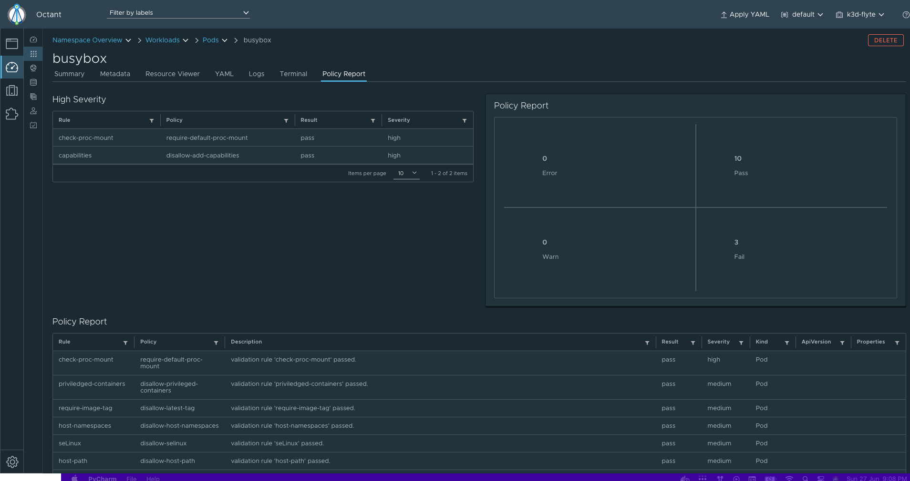

## Policy Report octant plugin 
[Under development]



## Installation

Install policyreport-octant-plugin
```bash
$ curl -s https://raw.githubusercontent.com/evalsocket/policyreport-octant-plugin/master/install.sh | bash
$ mv bin/policyreport ~/.config/octant/plugins/
```

Build the plugin manually:
`go build -o policyreport-octant-plugin  cmd/policyrepor-octant-plugin/main.go `
 
Then move the binary:

`mv policyreport-octant-plugin ~/.config/octant/plugins/`

You may need to create this directory if it does not exist.

